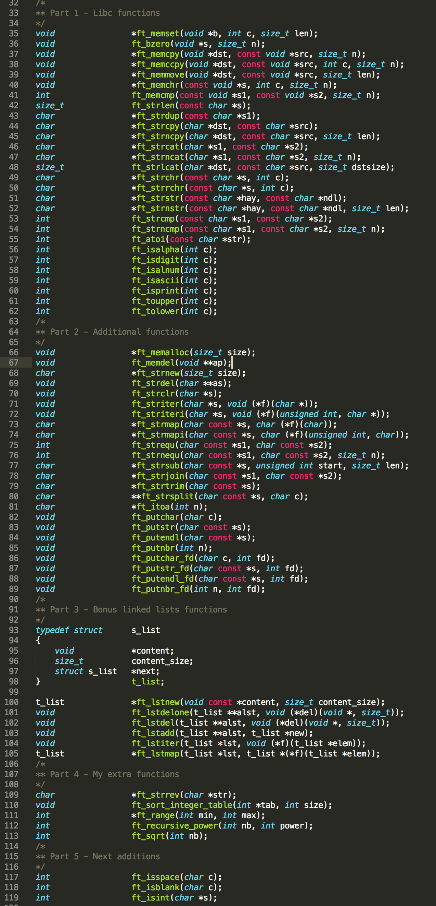
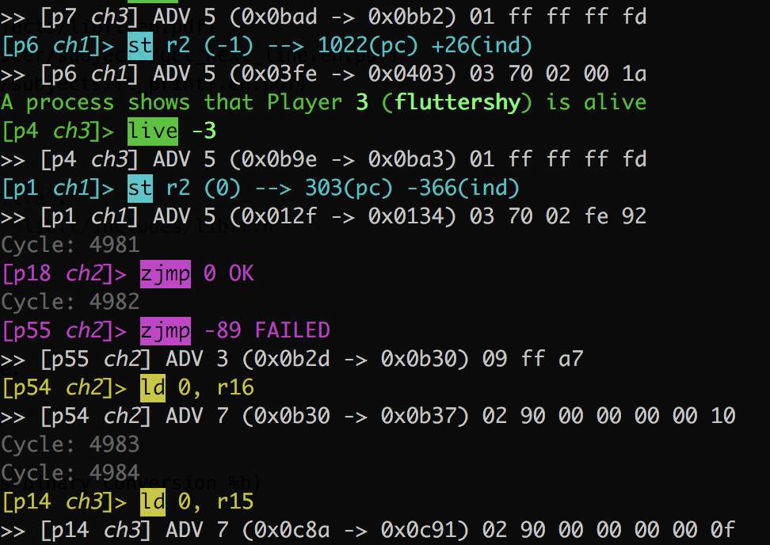
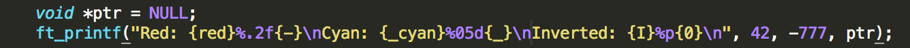
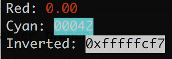

# libft

Library of C functions, coded during my School 42 studies. 



## Description

In C projects of School 42 we are not allowed to use almost any standard library functions. Instead, we had to code our own versions of them.

This library incorporates 3 school projects plus a few additional functions.

**Detailed description of the tasks solved:**

* [libft](https://github.com/dstepanets/libft/blob/master/subjects/libft.en.pdf)
* [Get Next Line](https://github.com/dstepanets/libft/blob/master/subjects/get_next_line.en.pdf)
* [ft_printf](https://github.com/dstepanets/libft/blob/master/subjects/ft_printf.en.pdf)

## Usage

1. Compile with `make`. This produses the static library `libft.a`.
2. Include the libft header into your source files: `#include "libft/includes/libft.h"`
3. Compile your source files with `libft.a`.

## ft_printf

This function was a separate project and took a while to write.

**We had to implement:**

* conversions: `%c %s %p %d %i %o %u %x %X %f` (I have a bonus binary conversion %b)
* length modifiers: `hh, h, l, ll`
* flags: `#, 0, -, +, <space>`
* minimum field-width
* precision

### Colors

As a bonus, my printf also supports styled/colored output to terminal. As an example, here is [Corewar](https://github.com/bjarne0706/corewar) log printed with my ft_printf.



#### Colors usage

Example:



Outputs:



```
FORMATTING:
{0} - Normal Text - Reset all attributes
{b} - Bold/Bright
{d} - Dim
{u} - Underlined
{i} - italic
{I} - inverted

TEXT COLORS:
{-}	- default
{red}
{blue}
{green}
{yellow}
{magenta}
{cyan}
{black}
{white}
{lightgray}
{darkgray}

BACKGROUND COLORS:
{_}	- default
{_*}		- where * is the same as text colors.
```
